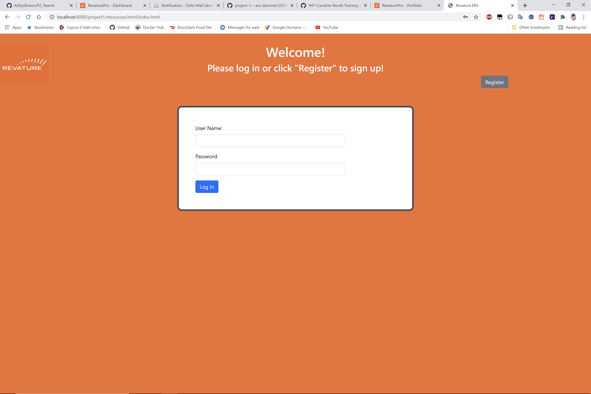

# Expense Reimbursement System (ERS)
An Employee Reimbursement System used to create, track, and update tickets for employee reimbursement. The employees can log in to the system or register for a new account. Then, they can view past tickets and create new tickets. The Financial Managers can also log in and/or register as well as approve or reject reimbursement tickets and view a catalog of every ticket recorded in the database. 

# Technologies Used
* Tomcat
* Servlets
* AJAX
* Git
* Maven
* Java
* JavaScript
* HTML
* CSS
* Bootstrap
* RDS
* SQL
* JDBC

# Features
List of features ready and TODOs for future development

* Users can log in and register for their own accounts.
* Users can submit reimbursement claims.
* Users can view a list of all of the reimbursements they have submitted
* Managers can approve or reject reimbursement claims submitted by users.
* Managers can view a list of all of the reimbursement claims submitted sorted in order of status (i.e. PENDING, APPROVED, DENIED) 

# Stretch Goals

* Users will be able to log out without being able to look at their reimbursement claims
* Users will be able to view more detailed information about a specific reimbursement claim at the click of a button
* Managers will be able to filter the list of reimbursements by status

# Getting Started
git clone https://github.com/dommie123/project-1---ers-dommie123/edit/main/README.md 

For further setup, you will need: 

* Eclipse IDE or STS (Spring Tools Suite) 4,
* Tomcat 9

When running the project, be sure to configure your Tomcat server in your IDE.
Then, run the project on the server.

You should come across this page once you've set up the project correctly.

# License
This project uses the following license: MIT License.
